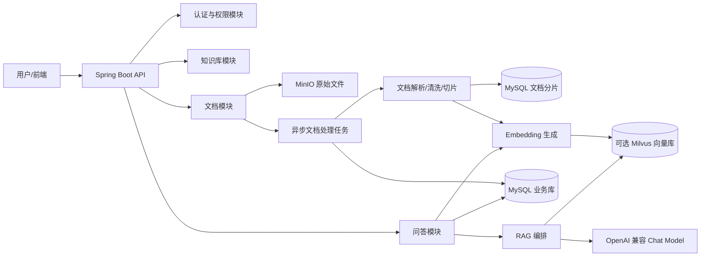
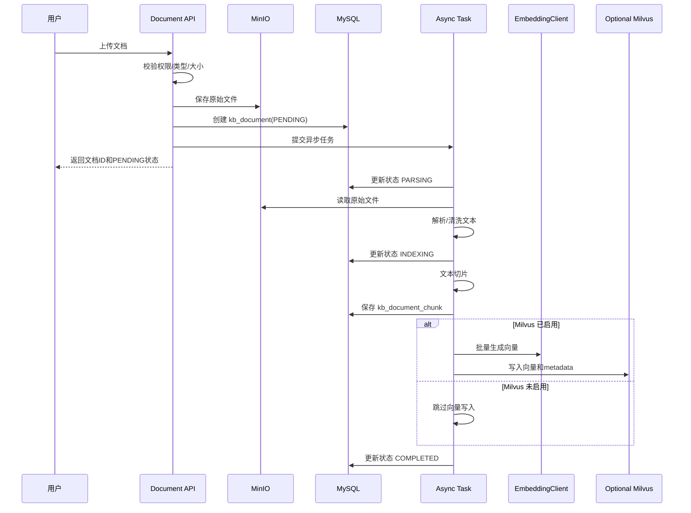
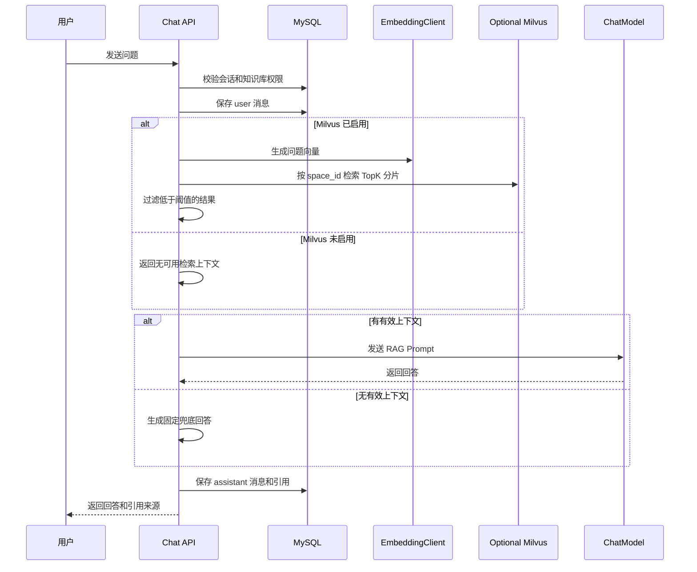

# AI 知识库平台系统设计

## 1. 设计概述

本文档基于《AI知识库平台需求文档》编写，面向第一阶段 MVP 开发落地。系统采用 Java 21、Spring Boot 3.x、MySQL 8.0、MinIO、可选 Milvus 和 OpenAI 兼容模型接口，建设一个支持文档上传、解析、切片、可选向量化、检索增强问答、引用溯源、权限控制和问答记录的 AI 知识库平台。

第一阶段只设计后端、接口、数据、AI/RAG、部署与运维。前端不做详细技术设计，仅保留 API 对接边界。

### 1.1 设计目标

- 支持用户登录、知识库管理、文档上传和文档处理状态查询。
- 支持 PDF、TXT、Markdown 文档解析、清洗、切片和可选向量入库。
- 支持基于知识库的自然语言问答，并返回引用来源。
- 支持知识库级权限控制，防止越权访问和越权检索。
- 支持 Docker Compose 本地部署。
- 支持后续扩展模型供应商、向量库、消息队列和文档解析器。

### 1.2 技术基线

| 类型 | 选型 |
| --- | --- |
| 后端语言 | Java 21 |
| 后端框架 | Spring Boot 3.x |
| AI 框架 | 当前直接对接 OpenAI 兼容 HTTP 接口，后续可接 Spring AI |
| 模型接口 | OpenAI 兼容接口 |
| 数据库 | MySQL 8.0 |
| 向量能力 | Milvus，可通过 `VECTOR_MILVUS_ENABLED` 关闭 |
| 文件存储 | MinIO |
| 认证授权 | Spring Security + JWT |
| 数据访问 | MyBatis Plus |
| 异步任务 | ThreadPoolTaskExecutor |
| 部署 | Docker Compose |

## 2. 总体架构

### 2.1 架构图



### 2.2 应用形态

MVP 采用单体模块化 Spring Boot 应用，内部按工程职责分层，业务能力在各层内按领域包继续拆分，避免第一阶段过早拆分微服务。后续当文档解析、模型调用或问答服务出现独立扩容需求时，可拆分为文档处理服务、检索服务和问答服务。

推荐包结构：

```text
com.example.aikb
  start
    controller
      auth
      space
      document
      chat
      admin
    config
    health
  trigger
    job
    schedule
    consumer
  service
    auth
    user
    space
    document
    index
    chat
    admin
    dto
  core
    auth
    user
    space
    document
    index
    chat
    admin
    model
    converter
  manager
    auth
    user
    space
    document
    index
    chat
    admin
    bo
    converter
  dal
    mapper
      auth
      user
      space
      document
      chat
      admin
    model
      auth
      user
      space
      document
      chat
      admin
  integration
    llm
    vector
    storage
    documentreader
  common
    constants
    enums
    exception
    properties
    filter
    aspect
  tests
```

分层职责：

| 层 | 职责 | 约束 |
| --- | --- | --- |
| `start` | 应用启动和组装层，包含 Spring Boot 启动类、应用配置文件、健康检查静态页、HTTP Controller、打包插件 | Controller 只做协议适配、鉴权注解、参数校验和响应转换 |
| `trigger` | 消息消费、定时任务、Job 入口 | 只做触发接入、参数校验和入口转发，不承载核心业务逻辑 |
| `service` | 对外服务接口、入参出参 DTO、服务实现、统一异常边界和对 core 层的调用编排 | 不直接写复杂业务规则，不直接调用外部系统 SDK |
| `core` | 业务规则、业务校验、业务流程编排和内部对象转换 | 可调用 `manager`、`integration` 和 `common`，不得依赖 `start`、`trigger`、`dal` |
| `manager` | 数据管理层，封装 DAL 层 mapper，提供数据库表操作的原子逻辑，完成 `***DO` 到 `***BO` 的转换 | 不开启数据库事务，非特殊情况不可捕获异常 |
| `dal` | 数据库持久层，包含 mapper 接口、mapper.xml 和 `***DO` 数据模型 | 只能单表操作，不能出现联表操作 |
| `integration` | 外部系统 HTTP/RPC 调用、外部 DTO、超时/失败/幂等处理和外部响应转换 | 不承载入口逻辑和业务决策 |
| `common` | 工具类、常量、枚举、异常、配置属性、过滤器、切面等可复用内容 | 不包含具体业务流程 |
| `tests` | 集成测试、冒烟测试、部署验证类测试 | 不作为业务运行层 |
 
依赖方向：

```text
start -> service -> core
trigger -> service -> core
service -> core
core -> manager -> dal
core -> integration
manager -> common
dal -> common
integration -> common
tests -> start/service/core/manager/integration/dal
```

### 2.3 数据访问规范

`manager` 层：

- 注入 DAL 层 mapper 对象，简单封装 mapper 的原子表操作。
- 业务对象统一以 `***BO` 命名，例如 `UserBO`、`SpaceBO`、`DocumentChunkBO`。
- 完成 `***DO` 到 `***BO` 的转换，不向 `core` 暴露 DO。
- 可访问 Redis、Elasticsearch 等非关系型数据库。
- 可以作为 `@DCH` 注解标记方法的发生场所。
- 不开启数据库事务；事务边界放在 `service` 或需要编排一致性的上层。
- 非特殊情况不可捕获异常，交由上层统一异常边界处理。

`dal` 层：

- 数据模型对象统一以 `***DO` 命名，例如 `UserDO`、`SpaceDO`、`DocumentDO`。
- mapper 接口方法必须以 `insert`、`delete`、`update`、`select` 开头。
- DAL 只能单表操作，不能出现联表操作。
- `mapper.xml` 必须按照标准格式书写。
- `mapper.xml` 每个方法必须加注释。
- `mapper.xml` 任何表操作语句，表名必须起别名。
- `mapper.xml` 方法尽量不要出现大量动态条件。
- 无意义 ID 在 insert 操作中不需要先获取序列，直接写在 SQL 中，减少数据库交互。

### 2.4 外部依赖

- MySQL 8.0：保存业务数据和文档分片元数据。
- Milvus：提供可选向量存储和相似度检索。
- MinIO：保存用户上传的原始文件。
- OpenAI 兼容模型服务：提供 Chat Model 和 Embedding Model。

## 3. 业务领域设计

以下为业务领域划分，不代表顶层包结构。每个领域按实际职责分别落到 `start`、`service`、`core`、`integration`、`common` 等工程层中。

### 3.1 认证与权限领域 `auth`

职责：

- 用户登录、退出、当前用户信息查询。
- JWT 生成、校验和刷新。
- Spring Security 过滤链配置。
- 将当前用户 ID、系统角色和知识库权限注入请求上下文。

关键规则：

- 除登录接口外，所有业务接口必须携带 JWT。
- 用户状态为 `DISABLED` 时拒绝登录和访问。
- 系统管理员拥有全部知识库管理权限。
- 普通用户访问知识库时必须命中 `kb_space_member` 成员记录或知识库可见范围规则。

### 3.2 用户领域 `user`

职责：

- 用户新增、编辑、禁用、启用。
- 用户角色绑定。
- 用户列表和详情查询。

MVP 内置角色：

| 角色 | 说明 |
| --- | --- |
| `SYSTEM_ADMIN` | 系统管理员 |
| `USER` | 普通平台用户 |

### 3.3 知识库领域 `space`

职责：

- 知识库创建、修改、删除、详情查询和列表查询。
- 知识库成员管理。
- 知识库默认 RAG 参数配置。

知识库成员角色：

| 角色 | 权限 |
| --- | --- |
| `OWNER` | 管理知识库、成员、文档和问答 |
| `ADMIN` | 管理文档、重建索引、问答 |
| `READER` | 只读问答和查看引用 |

默认参数：

| 参数 | 默认值 | 说明 |
| --- | --- | --- |
| `topK` | 5 | 向量检索数量 |
| `similarityThreshold` | 0.7 | 最低相似度阈值 |
| `temperature` | 0.2 | 回答生成随机性 |
| `chunkSize` | 800 tokens | 文档切片大小 |
| `chunkOverlap` | 120 tokens | 分片重叠长度 |

### 3.4 文档领域 `document`

职责：

- 文档上传。
- 原始文件保存到 MinIO。
- 文档元数据落库。
- 文档状态查询。
- 文档删除。
- 触发重建索引。

支持文件类型：

| 类型 | MVP 状态 |
| --- | --- |
| PDF | 支持 |
| TXT | 支持 |
| Markdown | 支持 |
| DOCX | 预留扩展点，非 MVP 强验收 |

文档状态：

| 状态 | 说明 |
| --- | --- |
| `PENDING` | 已上传，等待处理 |
| `PARSING` | 正在解析文本 |
| `INDEXING` | 正在切片并写入向量索引 |
| `COMPLETED` | 处理完成，可参与问答 |
| `FAILED` | 处理失败 |

### 3.5 索引领域 `index`

职责：

- 根据文档类型选择解析器。
- 清洗文本内容。
- 按 Token 估算长度切片。
- 调用 OpenAI 兼容 Embedding 接口生成向量。
- 在 `VECTOR_MILVUS_ENABLED=true` 时写入 Milvus。
- 保存业务分片记录。

切片策略：

- 默认 `chunkSize=800 tokens`。
- 默认 `chunkOverlap=120 tokens`。
- 每个分片保留 `spaceId`、`documentId`、`chunkId`、`fileName`、`pageNumber`、`chunkIndex` 等 metadata。
- 向量 metadata 必须包含 `space_id`，用于检索权限过滤。

### 3.6 问答领域 `chat`

职责：

- 创建问答会话。
- 保存用户问题。
- 对问题生成 Embedding。
- 按知识库和权限过滤检索相关分片。
- 构造 RAG Prompt。
- 调用 OpenAI 兼容 Chat 接口生成回答。
- 支持普通返回和 SSE 流式返回。
- 保存回答、引用来源、耗时和 Token 统计。

RAG 策略：

- MVP 采用自定义 RAG 编排，不直接隐藏在黑盒 Advisor 中。
- 检索无结果时，不调用或少调用 Chat Model，直接返回“当前知识库中未找到相关信息”。
- 回答必须只基于检索上下文，不允许编造来源。

### 3.7 后台领域 `admin`

职责：

- 模型配置管理。
- 文档处理任务状态查询。
- 问答日志查询。
- 系统运行状态查看。

MVP 不实现复杂审计审批，只保留基础查询和配置能力。

## 4. 核心流程设计

### 4.1 文档入库流程



失败处理：

- 解析、切片、分片落库失败时，文档状态更新为 `FAILED`。
- `VECTOR_MILVUS_ENABLED=true` 时，Embedding 或向量写入失败，文档状态更新为 `FAILED`。
- `VECTOR_MILVUS_ENABLED=false` 时，跳过 Embedding 和向量写入，文档可正常进入 `COMPLETED`。
- `error_message` 记录可读失败原因。
- 重建索引时先删除旧分片和旧向量，再重新处理；失败后文档状态为 `FAILED`，旧索引不再保留。

### 4.2 知识库问答流程



### 4.3 Prompt 模板

```text
你是企业知识库助手。请只根据提供的上下文回答用户问题。
如果上下文中没有答案，请回答“当前知识库中未找到相关信息”。
不要编造事实，不要编造引用来源。
回答应简洁、准确、结构清晰。

上下文：
{context}

用户问题：
{question}
```

上下文格式：

```text
[引用1] 文档：{fileName}，页码：{pageNumber}，分片：{chunkIndex}
{content}
```

## 5. 数据库设计

### 5.1 `sys_user`

| 字段 | 类型 | 约束 | 说明 |
| --- | --- | --- | --- |
| id | bigint | PK | 用户 ID |
| username | varchar(64) | unique, not null | 用户名 |
| password_hash | varchar(255) | not null | 密码哈希 |
| display_name | varchar(64) | not null | 显示名称 |
| email | varchar(128) |  | 邮箱 |
| status | varchar(32) | not null | `ENABLED`/`DISABLED` |
| created_at | timestamp | not null | 创建时间 |
| updated_at | timestamp | not null | 更新时间 |

### 5.2 `sys_role`

| 字段 | 类型 | 约束 | 说明 |
| --- | --- | --- | --- |
| id | bigint | PK | 角色 ID |
| role_code | varchar(64) | unique, not null | 角色编码 |
| role_name | varchar(64) | not null | 角色名称 |
| created_at | timestamp | not null | 创建时间 |

### 5.3 `sys_user_role`

| 字段 | 类型 | 约束 | 说明 |
| --- | --- | --- | --- |
| id | bigint | PK | 主键 |
| user_id | bigint | index, not null | 用户 ID |
| role_id | bigint | index, not null | 角色 ID |

唯一约束：`uk_user_role(user_id, role_id)`。

### 5.4 `kb_space`

| 字段 | 类型 | 约束 | 说明 |
| --- | --- | --- | --- |
| id | bigint | PK | 知识库 ID |
| name | varchar(128) | not null | 名称 |
| description | text |  | 描述 |
| owner_id | bigint | index, not null | 所有人 |
| visibility | varchar(32) | not null | `PRIVATE`/`INTERNAL` |
| top_k | int | not null | 默认检索数量 |
| similarity_threshold | numeric(5,4) | not null | 相似度阈值 |
| temperature | numeric(4,3) | not null | 模型温度 |
| chunk_size | int | not null | 分片大小 |
| chunk_overlap | int | not null | 分片重叠 |
| created_at | timestamp | not null | 创建时间 |
| updated_at | timestamp | not null | 更新时间 |

索引：

- `idx_kb_space_owner(owner_id)`。
- `idx_kb_space_visibility(visibility)`。

### 5.5 `kb_space_member`

| 字段 | 类型 | 约束 | 说明 |
| --- | --- | --- | --- |
| id | bigint | PK | 主键 |
| space_id | bigint | index, not null | 知识库 ID |
| user_id | bigint | index, not null | 用户 ID |
| role | varchar(32) | not null | `OWNER`/`ADMIN`/`READER` |
| created_at | timestamp | not null | 创建时间 |

唯一约束：`uk_space_user(space_id, user_id)`。

### 5.6 `kb_document`

| 字段 | 类型 | 约束 | 说明 |
| --- | --- | --- | --- |
| id | bigint | PK | 文档 ID |
| space_id | bigint | index, not null | 知识库 ID |
| file_name | varchar(255) | not null | 原始文件名 |
| file_type | varchar(32) | not null | 文件类型 |
| file_size | bigint | not null | 文件大小 |
| storage_bucket | varchar(128) | not null | MinIO bucket |
| storage_object_key | varchar(512) | not null | MinIO object key |
| parse_status | varchar(32) | index, not null | 处理状态 |
| error_message | text |  | 失败原因 |
| uploaded_by | bigint | index, not null | 上传人 |
| created_at | timestamp | not null | 创建时间 |
| updated_at | timestamp | not null | 更新时间 |

索引：

- `idx_document_space_status(space_id, parse_status)`。
- `idx_document_uploaded_by(uploaded_by)`。

### 5.7 `kb_document_chunk`

| 字段 | 类型 | 约束 | 说明 |
| --- | --- | --- | --- |
| id | bigint | PK | 分片 ID |
| space_id | bigint | index, not null | 知识库 ID |
| document_id | bigint | index, not null | 文档 ID |
| chunk_index | int | not null | 分片序号 |
| content | text | not null | 分片内容 |
| page_number | int |  | 页码 |
| token_count | int |  | Token 数 |
| vector_id | varchar(128) | index | 向量记录 ID |
| created_at | timestamp | not null | 创建时间 |

索引：

- `idx_chunk_space_document(space_id, document_id)`。
- `idx_chunk_vector_id(vector_id)`。

### 5.8 `kb_chat_session`

| 字段 | 类型 | 约束 | 说明 |
| --- | --- | --- | --- |
| id | bigint | PK | 会话 ID |
| space_id | bigint | index, not null | 知识库 ID |
| user_id | bigint | index, not null | 用户 ID |
| title | varchar(128) | not null | 会话标题 |
| created_at | timestamp | not null | 创建时间 |
| updated_at | timestamp | not null | 更新时间 |

### 5.9 `kb_chat_message`

| 字段 | 类型 | 约束 | 说明 |
| --- | --- | --- | --- |
| id | bigint | PK | 消息 ID |
| session_id | bigint | index, not null | 会话 ID |
| role | varchar(32) | not null | `user`/`assistant` |
| content | text | not null | 消息内容 |
| model_name | varchar(128) |  | 模型名称 |
| prompt_tokens | int |  | 输入 Token |
| completion_tokens | int |  | 输出 Token |
| latency_ms | bigint |  | 耗时 |
| created_at | timestamp | not null | 创建时间 |

### 5.10 `kb_answer_citation`

| 字段 | 类型 | 约束 | 说明 |
| --- | --- | --- | --- |
| id | bigint | PK | 引用 ID |
| message_id | bigint | index, not null | assistant 消息 ID |
| document_id | bigint | index, not null | 文档 ID |
| chunk_id | bigint | index, not null | 分片 ID |
| score | numeric(8,6) | not null | 相似度分数 |
| quote_text | text | not null | 引用片段 |
| created_at | timestamp | not null | 创建时间 |

### 5.11 `sys_model_config`

| 字段 | 类型 | 约束 | 说明 |
| --- | --- | --- | --- |
| id | bigint | PK | 配置 ID |
| provider | varchar(64) | not null | `openai-compatible` |
| base_url | varchar(255) | not null | 模型服务地址 |
| api_key_ref | varchar(128) | not null | API Key 环境变量名 |
| chat_model | varchar(128) | not null | 聊天模型 |
| embedding_model | varchar(128) | not null | Embedding 模型 |
| enabled | boolean | not null | 是否启用 |
| created_at | timestamp | not null | 创建时间 |
| updated_at | timestamp | not null | 更新时间 |

说明：真实 API Key 只通过环境变量读取，数据库仅保存引用名。

## 6. 向量表设计

Milvus 是可选向量能力。当前代码通过 `VECTOR_MILVUS_ENABLED` 控制是否启用：

- `false`：不连接 Milvus。文档上传后完成 MinIO 存储、文本解析、清洗、切片和 `kb_document_chunk` 落库，向量写入和向量检索跳过。
- `true`：连接独立 Milvus 服务，写入和检索文档分片向量。

当前实现通过 Milvus HTTP API 写入和检索，collection 字段由服务初始化；后续可演进为 Spring AI Milvus VectorStore。

每条向量 Document 的 metadata 必须包含：

```json
{
  "space_id": "1001",
  "document_id": "2001",
  "chunk_id": "3001",
  "file_name": "产品手册.pdf",
  "page_number": 5,
  "chunk_index": 12,
  "uploaded_by": "9001"
}
```

检索过滤条件：

- 必须包含 `space_id = 当前会话所属知识库 ID`。
- 普通用户必须先通过业务权限校验后才能检索。
- MVP 不做文档级权限；后续如增加文档级权限，metadata 需补充可见范围字段。

## 7. API 设计

### 7.1 通用响应

```json
{
  "code": 0,
  "message": "success",
  "data": {}
}
```

错误响应：

```json
{
  "code": 40001,
  "message": "Unauthorized",
  "data": null
}
```

### 7.2 认证接口

#### `POST /api/auth/login`

请求：

```json
{
  "username": "admin",
  "password": "password"
}
```

响应：

```json
{
  "code": 0,
  "message": "success",
  "data": {
    "accessToken": "jwt-token",
    "expiresIn": 7200,
    "user": {
      "id": 1,
      "username": "admin",
      "displayName": "管理员",
      "roles": ["SYSTEM_ADMIN"]
    }
  }
}
```

#### `GET /api/auth/me`

返回当前登录用户信息。

### 7.3 知识库接口

#### `POST /api/spaces`

权限：登录用户。

请求：

```json
{
  "name": "产品知识库",
  "description": "产品资料、常见问题和使用手册",
  "visibility": "PRIVATE",
  "topK": 5,
  "similarityThreshold": 0.7,
  "temperature": 0.2
}
```

响应：

```json
{
  "code": 0,
  "message": "success",
  "data": {
    "id": 1001,
    "name": "产品知识库"
  }
}
```

#### `GET /api/spaces`

权限：登录用户。

说明：只返回当前用户可访问的知识库。系统管理员返回全部。

#### `GET /api/spaces/{id}`

权限：知识库成员或系统管理员。

#### `PUT /api/spaces/{id}`

权限：`OWNER`、`ADMIN` 或系统管理员。

#### `DELETE /api/spaces/{id}`

权限：`OWNER` 或系统管理员。

### 7.4 知识库成员接口

#### `POST /api/spaces/{spaceId}/members`

权限：`OWNER` 或系统管理员。

请求：

```json
{
  "userId": 2,
  "role": "READER"
}
```

#### `GET /api/spaces/{spaceId}/members`

权限：`OWNER`、`ADMIN` 或系统管理员。

#### `DELETE /api/spaces/{spaceId}/members/{userId}`

权限：`OWNER` 或系统管理员。

### 7.5 文档接口

#### `POST /api/spaces/{spaceId}/documents`

权限：`OWNER`、`ADMIN` 或系统管理员。

请求：`multipart/form-data`

| 字段 | 类型 | 说明 |
| --- | --- | --- |
| file | file | PDF、TXT、Markdown |

响应：

```json
{
  "code": 0,
  "message": "success",
  "data": {
    "documentId": 2001,
    "fileName": "产品手册.pdf",
    "status": "PENDING"
  }
}
```

#### `GET /api/spaces/{spaceId}/documents`

权限：知识库成员或系统管理员。

#### `GET /api/documents/{id}`

权限：文档所属知识库成员或系统管理员。

#### `DELETE /api/documents/{id}`

权限：`OWNER`、`ADMIN` 或系统管理员。

行为：

- 删除 `kb_document_chunk`。
- `VECTOR_MILVUS_ENABLED=true` 时删除对应向量；未启用时跳过向量删除。
- 删除 MinIO 原始文件。
- 删除或软删除 `kb_document`。MVP 推荐软删除，字段可在实现时增加 `deleted_at`。

#### `POST /api/documents/{id}/reindex`

权限：`OWNER`、`ADMIN` 或系统管理员。

行为：

- 删除旧分片和旧向量。
- 文档状态重置为 `PENDING`。
- 重新提交异步处理任务。

### 7.6 问答接口

#### `POST /api/spaces/{spaceId}/chat/sessions`

权限：知识库成员或系统管理员。

请求：

```json
{
  "title": "新会话"
}
```

响应：

```json
{
  "code": 0,
  "message": "success",
  "data": {
    "sessionId": 5001,
    "title": "新会话"
  }
}
```

#### `POST /api/chat/sessions/{sessionId}/messages`

权限：会话所属知识库成员或系统管理员。

请求：

```json
{
  "question": "这个产品如何配置单点登录？"
}
```

响应：

```json
{
  "code": 0,
  "message": "success",
  "data": {
    "messageId": 7002,
    "answer": "根据产品手册，单点登录需要先在后台启用 SSO...",
    "citations": [
      {
        "documentId": 2001,
        "documentName": "产品手册.pdf",
        "chunkId": 3001,
        "pageNumber": 5,
        "score": 0.823412,
        "quoteText": "管理员可在系统设置中启用 SSO..."
      }
    ]
  }
}
```

#### `POST /api/chat/sessions/{sessionId}/messages/stream`

权限：会话所属知识库成员或系统管理员。

响应类型：`text/event-stream`

事件：

```text
event: message
data: {"delta":"根据产品手册，"}

event: citation
data: [{"documentId":2001,"documentName":"产品手册.pdf","chunkId":3001,"pageNumber":5,"score":0.823412}]

event: done
data: {"messageId":7002}
```

错误事件：

```text
event: error
data: {"code":50001,"message":"模型服务调用失败"}
```

#### `GET /api/chat/sessions/{sessionId}/messages`

权限：会话所属知识库成员或系统管理员。

### 7.7 后台接口

#### `GET /api/admin/model-config`

权限：系统管理员。

#### `PUT /api/admin/model-config`

权限：系统管理员。

请求：

```json
{
  "provider": "openai-compatible",
  "baseUrl": "https://api.example.com/v1",
  "apiKeyRef": "AI_API_KEY",
  "chatModel": "gpt-4o-mini",
  "embeddingModel": "text-embedding-3-small",
  "enabled": true
}
```

#### `GET /api/admin/chat-logs`

权限：系统管理员。

#### `GET /api/admin/document-tasks`

权限：系统管理员。

## 8. DTO 和枚举

### 8.1 核心 DTO

```java
public record LoginRequest(String username, String password) {}

public record SpaceCreateRequest(
    String name,
    String description,
    String visibility,
    Integer topK,
    BigDecimal similarityThreshold,
    BigDecimal temperature
) {}

public record DocumentUploadResponse(
    Long documentId,
    String fileName,
    String status
) {}

public record ChatMessageRequest(String question) {}

public record ChatMessageResponse(
    Long messageId,
    String answer,
    List<CitationDTO> citations
) {}

public record CitationDTO(
    Long documentId,
    String documentName,
    Long chunkId,
    Integer pageNumber,
    BigDecimal score,
    String quoteText
) {}
```

### 8.2 枚举

```java
public enum UserStatus {
    ENABLED, DISABLED
}

public enum SpaceRole {
    OWNER, ADMIN, READER
}

public enum DocumentStatus {
    PENDING, PARSING, INDEXING, COMPLETED, FAILED
}

public enum ChatRole {
    user, assistant
}
```

## 9. 权限设计

### 9.1 权限矩阵

| 操作 | 系统管理员 | OWNER | ADMIN | READER |
| --- | --- | --- | --- | --- |
| 查看知识库 | 是 | 是 | 是 | 是 |
| 修改知识库 | 是 | 是 | 是 | 否 |
| 删除知识库 | 是 | 是 | 否 | 否 |
| 管理成员 | 是 | 是 | 否 | 否 |
| 上传文档 | 是 | 是 | 是 | 否 |
| 删除文档 | 是 | 是 | 是 | 否 |
| 重建索引 | 是 | 是 | 是 | 否 |
| 发起问答 | 是 | 是 | 是 | 是 |
| 查看引用 | 是 | 是 | 是 | 是 |

### 9.2 检索安全规则

- Chat API 先校验用户是否有会话所属知识库访问权限。
- 向量检索必须附带 `space_id` 过滤条件。
- 不允许前端传入任意 metadata filter。
- 引用详情查询必须根据 `chunk_id` 反查 `kb_document_chunk` 并校验 `space_id` 权限。

## 10. 配置设计

### 10.1 环境变量

```properties
SPRING_DATASOURCE_URL=jdbc:mysql://mysql:3306/kb_base_db?useUnicode=true&characterEncoding=utf8&serverTimezone=Asia/Shanghai&useSSL=false&allowPublicKeyRetrieval=true
SPRING_DATASOURCE_USERNAME=<来自 application-local.yml>
SPRING_DATASOURCE_PASSWORD=<来自 application-local.yml>

MINIO_ENDPOINT=http://minio:9000
MINIO_ACCESS_KEY=minioadmin
MINIO_SECRET_KEY=minioadmin
MINIO_BUCKET=agent-documents

VECTOR_MILVUS_ENABLED=false
VECTOR_MILVUS_ENDPOINT=http://milvus:19530
VECTOR_MILVUS_COLLECTION_NAME=kb_document_chunks
VECTOR_MILVUS_DIMENSION=1536
VECTOR_MILVUS_TIMEOUT=30

AI_BASE_URL=https://api.example.com/v1
AI_API_KEY=replace-me
AI_CHAT_MODEL=gpt-4o-mini
AI_EMBEDDING_MODEL=text-embedding-3-small

JWT_SECRET=replace-with-long-random-secret
JWT_EXPIRES_IN=7200
```

### 10.2 模型与向量配置

当前实现直接调用 OpenAI 兼容接口：

- Chat：`/chat/completions`
- Embedding：`/embeddings`
- 未配置 `AI_EMBEDDING_MODEL` 时，使用本地哈希向量兜底，保证文档处理流程可完成。

Milvus 默认关闭。当前 2c2g 服务器不部署 Milvus/etcd，后续独立 Milvus 机器可用后再启用。

```yaml
agent:
  model:
    provider: ${AI_PROVIDER:mock}
    base-url: ${AI_BASE_URL:}
    api-key: ${AI_API_KEY:}
    chat-model: ${AI_CHAT_MODEL:}
    embedding-model: ${AI_EMBEDDING_MODEL:}

vector:
  milvus:
    enabled: ${VECTOR_MILVUS_ENABLED:false}
    endpoint: ${VECTOR_MILVUS_ENDPOINT:http://localhost:19530}
    collection-name: ${VECTOR_MILVUS_COLLECTION_NAME:kb_document_chunks}
    dimension: ${VECTOR_MILVUS_DIMENSION:1536}
    timeout: ${VECTOR_MILVUS_TIMEOUT:15}
```

## 11. 部署设计

### 11.1 Docker Compose 服务

```text
app
mysql
minio
```

当前 2c2g 线上服务器只运行 `app + mysql + minio + web`。Milvus/etcd 不在当前服务器部署，避免内存和 IO 压力导致 SSH、Docker 或业务入口卡死。

MySQL 初始化：

- 创建数据库 `kb_base_db`。
- 执行业务表 DDL。
- 初始化系统管理员和基础角色。

Milvus 初始化：

- 创建 collection：`kb_document_chunks`。
- 向量维度必须与 `AI_EMBEDDING_MODEL` 输出维度一致。
- metadata 字段至少包含 `space_id`、`document_id`、`chunk_id`、`file_name`、`page_number`、`chunk_index`。
- 仅在 `VECTOR_MILVUS_ENABLED=true` 且独立 Milvus 服务可用时执行。
- Milvus standalone 依赖 `etcd` 和对象存储。生产建议单独服务器，至少 `4c8g`，更推荐 `4c16g`。

MinIO 初始化：

- 创建 bucket：`agent-documents`。
- bucket 不开放匿名访问。

### 11.2 启动顺序

```text
mysql -> minio -> app -> web
```

应用启动检查：

- 数据库连接可用。
- MinIO bucket 可访问。
- `VECTOR_MILVUS_ENABLED=true` 时，Milvus collection 可访问。
- `VECTOR_MILVUS_ENABLED=false` 时，应用不应连接 Milvus。
- 模型配置存在。模型接口不可用时应用仍可启动，但问答和索引接口返回明确错误。

## 12. 可观测性设计

### 12.1 日志

必须记录：

- 用户登录成功和失败。
- 文档上传、解析开始、解析完成、解析失败。
- Embedding 调用耗时和失败原因。
- 向量检索 TopK、阈值、命中数量和最高分。
- Chat Model 调用耗时、模型名和失败原因。
- 问答请求总耗时。

禁止记录：

- API Key。
- 用户密码。
- 完整 JWT。

### 12.2 指标

预留 Spring Boot Actuator 和 Micrometer 指标：

- `document_index_total`
- `document_index_failed_total`
- `chat_request_total`
- `chat_request_failed_total`
- `model_call_latency`
- `vector_search_latency`

## 13. 异常和边界处理

| 场景 | 处理 |
| --- | --- |
| 上传不支持文件类型 | 返回 `400`，提示文件类型不支持 |
| 文件超过限制 | 返回 `400`，提示文件过大 |
| 文档解析失败 | 状态置为 `FAILED`，保存失败原因 |
| Embedding 调用失败 | 状态置为 `FAILED`，允许重建索引 |
| 模型问答失败 | 返回错误事件或错误响应，保存用户问题和失败日志 |
| 检索无结果 | 返回“当前知识库中未找到相关信息” |
| 用户无知识库权限 | 返回 `403` |
| 会话不属于当前知识库 | 返回 `403` 或 `404`，不泄露资源存在性 |

## 14. 测试设计

### 14.1 单元测试

- JWT 生成和解析。
- 权限判断逻辑。
- 文档类型校验。
- 文本清洗和切片。
- Prompt 构造。
- 检索结果阈值过滤。

### 14.2 集成测试

- 用户登录后创建知识库。
- OWNER 添加 READER 成员。
- ADMIN 上传文档并触发异步任务。
- 文档处理完成后生成分片记录和向量记录。
- READER 发起问答并收到引用来源。
- 非成员访问知识库返回 `403`。
- 删除文档后，该文档不再参与检索。

### 14.3 端到端验收

- Docker Compose 可启动全部服务。
- 系统管理员可登录。
- 用户可创建知识库。
- 用户可上传 PDF、TXT、Markdown。
- 文档状态可从 `PENDING` 流转到 `COMPLETED`。
- 问答结果基于上传文档生成。
- 回答包含文档名、页码或分片位置、相似度分数和引用片段。
- 无相关内容时不编造答案。
- 无权限用户无法访问文档、问答会话和引用来源。

## 15. 后续扩展

第二阶段建议扩展：

- RabbitMQ 或 Kafka 承接文档处理任务。
- DOCX、Excel、PPT 和网页 URL 解析。
- 混合检索：关键词检索 + 向量检索。
- Rerank 模型重排序。
- 文档级权限。
- OCR。
- 企业微信、钉钉、飞书集成。

第三阶段建议扩展：

- 多租户。
- 独立检索服务。
- 私有化模型部署。
- 知识库质量评测。
- 模型调用成本统计和限额。
